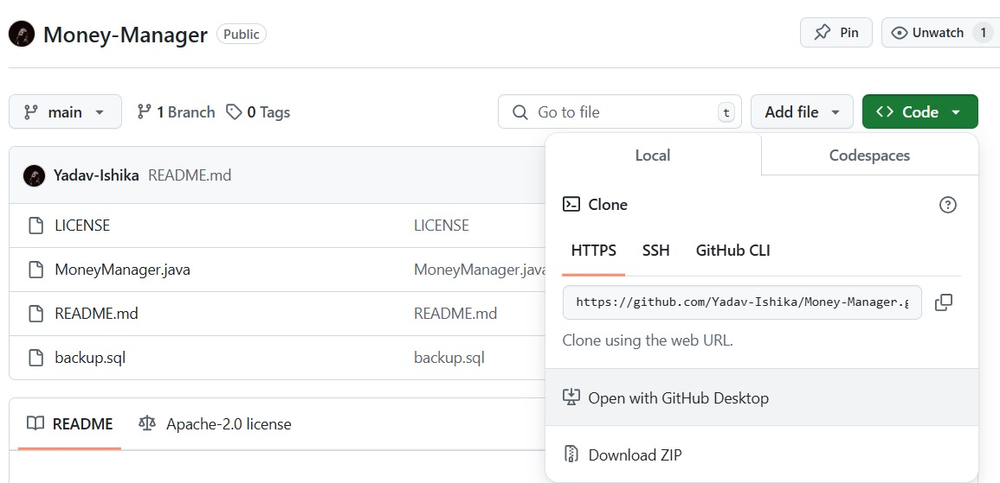

# Cloning Repository

## Description

In this repository, we will comprehensively explore fundamental concepts such as `Cloning`, `Repository`, `Git Commands`, and various other related topics. Additionally, we will delve into the essential commands required for `cloning` a repository, `staging` changes, `committing modifications`, `pushing` updates to a GitHub repository, and verifying the repository `status`. This documentation aims to provide a structured understanding of Git operations, facilitating efficient version control and collaborative development.

## What is cloning ?

A `Git repository` is a storage location (a folder) named as `.git` which contains several files and folders that tracks and manages all versions (updates) of a project's files. It contains the complete history of changes, including `commits`, `branches`, and `metadata`, allowing for efficient `version control` and collaboration. A repository can be `local` (on a personal machine like a laptop) or `remote` (hosted on platforms like `GitHub`, `GitLab`, or `Bitbucket`).

## What is Pushing ?

`Push` in Git is the process of transferring `committed` changes from a `local repository` to a `remote` repository. It ensures that updates made locally are reflected in the `remote repository`, enabling collaboration and version synchronization.

## Step-by-Step Guide to Cloning a Repository

<b>Step-1 :</b> `Open Terminal or Command Prompt`
- Navigate to the directory where you want to clone the repository.

<b>Step-2 :</b>
 `Copy the Repository URL`
-Obtain the repository URL from GitHub, GitLab, or another remote Git hosting platform.

<b>Step-3</b>

